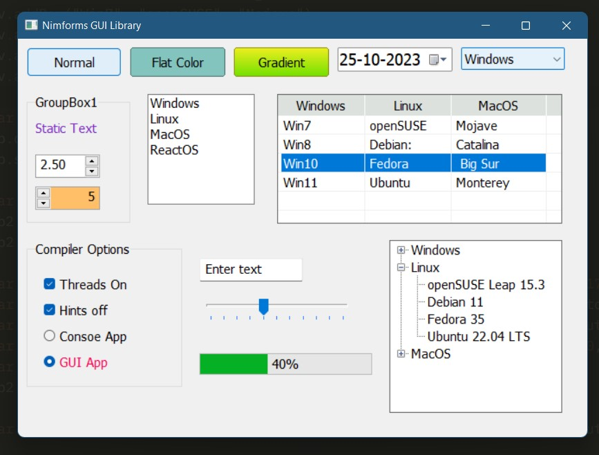

# Nimforms
A simple gui library for Nim programming language based on Windows API

## Screenshots
All controls


## How to use:
1. Clone or download the repo.
2. Place the **Nimforms** folder in your project folder.
3. Import **Nimforms/nimforms** module in your source file. And start coding.
4. NOTE: Copy and paste the `app.exe.manifest` file from this repo to your exe location. And rename the file with your exe file's name. For example, if your exe file's name is `program.exe`, the manifest file must be `program.exe.manifest`.


## Sample code
This is the code that created the window in above screenshot
```nim

import nimforms

var frm = newForm("Nimforms GUI Library", 675, 500)
frm.onMouseUp = proc(c: Control, e: MouseEventArgs) = echo "X: " & $e.x & " Y: " & $e.y
frm.createHandle()

var mbar = frm.addMenubar("Windows", "Linux", "ReactOS")
mbar.menus["Windows"].addItems("Windows 8", "Windows 10", "Windows 11")
mbar.menus["Windows"].menus["Windows 11"].addItem("My OS")

#Let's add a timer control which ticks in each 800 ms.
var tmr = frm.addTimer(800, proc(c: Form, e: EventArgs) = echo "Timer ticked...")

var btn = newButton(frm, "Normal", autoc=true)
var btn2 = newButton(frm, "Flat Color", btn.right + 10, autoc=true)
btn2.onClick = proc(c: Control, e: EventArgs) = tmr.start() # Button click will start the timer
btn2.backColor = 0x83c5be

var btn3 = newButton(frm, "Gradient", btn2.right + 10, autoc=true)
btn3.setGradientColor(0xeeef20, 0x70e000)

var dtp = newDateTimePicker(frm, btn3.right + 10, autoc = true)
dtp.font = newFont("Tahoma", 14)
dtp.foreColor = 0xe63946

var cmb = newComboBox(frm, dtp.right + 10, w=120)
cmb.addItems("Windows", "MacOS", "Linux", "ReactOS")
cmb.selectedIndex = 0

var gb = newGroupBox(frm, "GroupBox1", 10, btn.bottom + 20, 120, 150)

var lb = newLabel(frm, "Static Text", 20, gb.ypos + 30)
lb.foreColor = 0x7b2cbf

var lbx = newListBox(frm, gb.right + 20, btn.bottom + 20)
lbx.addItems("Windows", "Linux", "MacOS", "ReactOS")

var lv = newListView(frm, lbx.right + 10, btn.bottom + 20, ("Windows", "Linux", "MacOS", 100, 100, 110))
lv.addRow("Win7", "openSUSE", "Mojave")
lv.addRow("Win8", "Debian:", "Catalina")
lv.addRow("Win10", "Fedora", " Big Sur")
lv.addRow("Win11", "Ubuntu", "Monterey")

var np = newNumberPicker(frm, 20, lb.bottom + 40)
np.decimalDigits = 2
np.step = 0.5

var np2 = newNumberPicker(frm, 20, np.bottom + 10)
np2.buttonLeft = true
np2.backColor = 0xffbf69

var gb2 = newGroupBox(frm, "Compiler Options", 10, gb.bottom + 20, 180, 170, true)
var cb = newCheckBox(frm, "Threads On", gb2.xpos + 20, gb2.ypos + 40, autoc = true)
var cb2 = newCheckBox(frm, "Hints off", gb2.xpos + 20, cb.bottom + 10, autoc = true)
var rb = newRadioButton(frm, "Consoe App", gb2.xpos + 20, cb2.bottom + 10, autoc = true)
var rb2 = newRadioButton(frm, "GUI App", gb2.xpos + 20, rb.bottom + 10)
rb2.foreColor = 0xff0054

var tb = newTextBox(frm, "Enter text", gb2.right + 20, gb.bottom + 40, autoc = true)
var tkb = newTrackBar(frm, gb2.right + 20, tb.bottom + 20, cdraw = true, autoc=true)
var pgb = newProgressBar(frm, gb2.right + 20, tkb.bottom + 20, perc=true, autoc=true )

var tv = newTreeView(frm, pgb.right + 20, lv.bottom + 20, h=200, autoc=true)
tv.addTreeNodeWithChilds("Windows", "Win7", "Win8", "Win10", "Win11")
tv.addTreeNodeWithChilds("Linux", "openSUSE Leap 15.3", "Debian 11", "Fedora 35", "Ubuntu 22.04 LTS")
tv.addTreeNodeWithChilds("MacOS", "Mojave (10.14)", "Catalina (10.15)", " Big Sur (11.0)", "Monterey (12.0)")

proc btnClick(c: Control, e: EventArgs) {.handles:btn.onClick.} = # NEW !!! 'handles' pragma
    echo "clicked on btn"

proc onTrackChange(c: Control, e: EventArgs) {.handles:tkb.onValueChanged.} =
    pgb.value = tkb.value

frm.display() # All set, we can now show the form !

```
